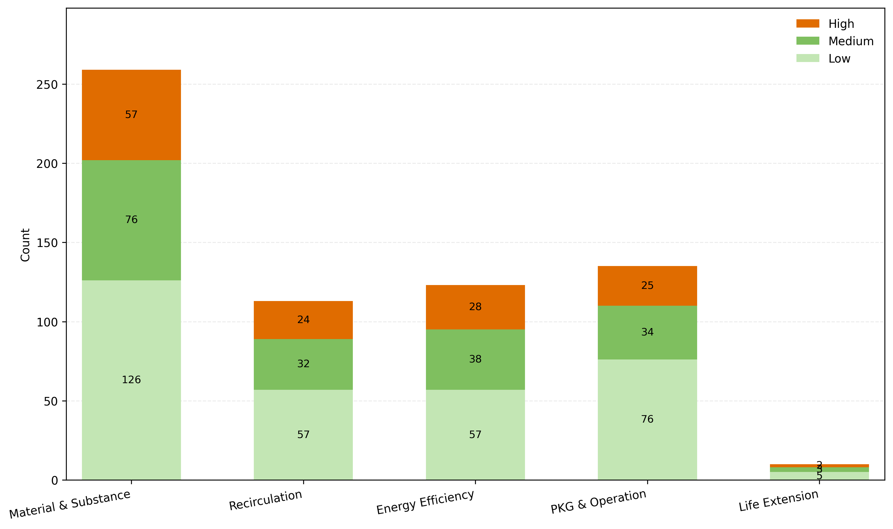

Regulation Update Chart

## Policy Table
| Indicator | 政策名称 | 内容概要/链接 | 适用产品 | 适用行业 | 实施日期 |
|---|---|---|---|---|---|
| Material & Substance | 加快电力装备绿色低碳创新发展行动计划 | 加快电力装备低碳创新，**5-8年**优化供给结构。 | Programmable Logic Controller, Power Supply, Controller Contactor, Thyristor Switch And Controller, Residual Current Operated Circuit-breaker with Integral Overcurrent Protection (RCBO), (+1) | Utilities, PowerOEM, Industrial, Commercialbuilding, Residential | 2022-08-24 |
| Energy Efficiency | 绿色高效制冷行动方案 | 推进绿色高效制冷，**降低能耗排放**提升行业水平。 | Chillers And Cooling Systems, Cooling Close To Heat Source | Building, Datacenter, Commercialbuilding, Other:HVAC/HOIST | 2019-06-13 |
| Recirculation | 智能光伏试点示范活动 | 开展智能光伏试点，**促进光伏与信息技术融合**。 | — | Newenergy | 2022-11-08 |
| Others | 关于深化电子电器行业管理制度改革的意见 | 改革电子电器管理制度，**优化准入流通**强化监管。 | — | Electronicindustry, Telecom/Commmunicationindustry | 2022-09-23 |
| PKG & Operation | 信息通信行业绿色低碳发展行动计划（2022–2025年） | 实施信息通信绿色低碳行动，**2022-2025**推动转型。 | — | Telecom/Commmunicationindustry | 2022-08-22 |
| Material & Substance | 绿色建筑和绿色建材政府采购需求标准 | 政府采购优先绿色建材，**明确需求标准**。 | — | Building, Commercialbuilding, Education, Healthcare | 2022-10-12 |
| Material & Substance | 智能冷藏集装箱终端设备技术指南 | 规范冷藏集装箱终端设备，**提升冷链港航服务**。 | — | Transportation, Marine | 2022-09-15 |
| Material & Substance | 原材料工业“三品”实施方案 | 推进原材料工业“三品”，**增品提质创牌**促升级。 | — | Oil&Gas, Mining, Minerals&Metals, Utilities, Newenergy, PowerOEM, Electronicindustry, Food&Beverage, LifeScience, Retail, Residential, Commercialbuilding, Building, Automotive, Transportation, Automobile, Electricvehicle, HVAC/HOIST | 2022-08-17 |
| Material & Substance | 推动轻工业高质量发展 | 推动轻工业高质量发展，**提升产业链竞争力**。 | — | Building, Commercialbuilding, Residential, Other:HVAC/HOIST, Electronicindustry, Electricvehicle, Newenergy, PowerOEM | 2022-06-08 |
| Material & Substance | 鼓励外商投资产业目录（2019年版） | 发布2019外商投资目录，**7月30日起施行**。 | — | Other:HVAC/HOIST, Electronicindustry, LifeScience, Food&Beverage, Retail, Water&wastewater, Printing, Building, Automotive, Marine, Textile, Leather, Woodworking, Furniture, Minerals&Metals, Cement | 2019-06-30 |
| Material & Substance | 印制电路板行业规范条件 | 出台PCB行业规范条件，**引导产业有序发展**。 | — | Electronicindustry | 2018-12-28 |
| Material & Substance | 生产者责任延伸制度推行方案 | 推行生产者责任延伸，**全生命周期回收与信息公开**。 | — | Electronicindustry, Automobile, Electricvehicle, Newenergy, Food&Beverage, PowerOEM, Utilities | 2017-01-03 |

## Key Insights
- 现行有效条目共 **640** 条，更新最集中在 **Material & Substance（259条）**。
- 其次为 **PKG & Operation（135条）**。
- Impact 分布：**Low 321 / Medium 183 / High 136**（High 占 **21.2%**）。
- 高影响条目优先反映与 **电气设备与能效**、合规认证/标准相关的要求变化。
- 重点关注 **电力装备、建筑/园区、数据中心、制造业** 等场景的合规变化与机会点。
- 可结合产品线与客户行业分布，优先评估 **高影响条目** 对认证、材料合规与能效指标的影响。

## Impact Rules
- `Low`：适用行业为空/`N/A`，或与施耐德相关性较弱的通用信息。
- `Medium`：命中行业/领域关键词（如工业、数据中心、能源等）或政策/环保关键词（如能效、排放、标准等），但缺少明确产品/技术指向。
- `High`：在 `Medium` 基础上，进一步命中施耐德/电气/能效产品关键词（如 UPS、断路器、控制器等），或与施耐德/电气相关信息更直接。
